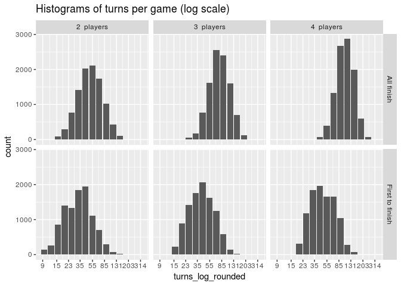

Snakes and Ladders
================
Marc van Heerden
July 24, 2017

Background
----------

I was playing the board game Snakes and Ladders with my kids with their bedtime quickly approaching. I wondered to myself what the distribution of playing time is for the game, measured in turns.

My kids like to play until every player is finished and I wondered how this would affect the distribution.

I had been wanting to try out Rcpp for a while so I decided this would be a fun, small project with lots of loops to try it out.

Simulation
----------

The board we were playing on was a 100 tile board, I decided to represent the snakes and ladders as follows. Since the vector is going to be used in Rcpp, the indexing is understood to start at 0 and the value represents the tile to move to when landing on the tile number of the index.

``` r
board1 <- read.csv("board1.csv", stringsAsFactors = FALSE, header = FALSE)
names(board1) <- "snakeladder"
head(board1)
```

    ##   snakeladder
    ## 1           0
    ## 2          38
    ## 3           2
    ## 4           3
    ## 5          14
    ## 6           5

I wrote up the functions below to simulate a multiplayer game, I suspect that my use of vectors instead of scalars is sub-optimal but being my first time I decided this was sufficient.

``` cpp
#include <RcppArmadilloExtensions/sample.h>
// [[Rcpp::depends(RcppArmadillo)]]

using namespace Rcpp ;

// [[Rcpp::export]]
NumericVector move(NumericVector dieOutcomes,
                   NumericVector board,
                   NumericVector maxPosition,
                   NumericVector startPosition
) { // Simulate a single move in a game
    NumericVector roll = RcppArmadillo::sample(dieOutcomes, 1, TRUE);
    // Rcout << "Start: " << startPosition << "\n";
    // Rcout << "Roll: " << roll << "\n";
    NumericVector midPosition = all(startPosition + roll < maxPosition).is_true() ? startPosition + roll : maxPosition;
    // Rcout << "Mid: " << midPosition << "\n";
    NumericVector endPosition = board[midPosition]; // calculate change in position due to a snake or a ladder
    // Rcout << "End: " << endPosition << "\n";
    return endPosition;
}

// [[Rcpp::export]]
NumericVector singlePlayer(NumericVector dieOutcomes,
                           NumericVector board,
                           NumericVector maxPosition,
                           int maxMoves
) { // Simulate a game for a single player up to a maximum number of moves
    NumericVector position = NumericVector::create(0);
    NumericVector moves = NumericVector::create(0);
    NumericVector one = NumericVector::create(1);
    
    for (int i = 1; i <= maxMoves; i++) {
        position = move(dieOutcomes, board, maxPosition, position);
        // Rcout << "Position: " << position << "\n";
        moves += one;
        if (all(position >= maxPosition).is_true()) {
            break;
        }
    }
    return moves;
}

// [[Rcpp::export]]
NumericVector batchSinglePlayer(NumericVector dieOutcomes,
                                NumericVector board,
                                NumericVector maxPosition,
                                int maxMoves,
                                int games
) { // Simulate a number of games for a single player and return the number of turns per game
    NumericVector turns(games);

    for (int i = 0; i < games; i++ ) {
        turns[i] = singlePlayer(dieOutcomes, board, maxPosition, maxMoves)[0]; 
    }
    
    return turns;
}

// [[Rcpp::export]]
NumericVector multiPlayer(NumericVector dieOutcomes,
                                NumericVector board,
                                NumericVector maxPosition,
                                int maxMoves,
                                int players,
                                bool allFinish
) { // Simulate turns taken for a multiplayer game
    NumericVector turns = NumericVector::create(0);
    
    NumericVector allTurns = batchSinglePlayer(dieOutcomes, board, maxPosition, maxMoves, players);
    
    if (allFinish) {
        turns[0] = sum(allTurns);
    } else {
        turns[0] = min(allTurns)*players; // not exactly, some approximation here with slight upward bias
    }
    
    return turns;
}
```

Then the function is used with dplyr in R to simulate games for various numbers of players under the all-must-finish and first-to-finish rules

``` r
suppressPackageStartupMessages({
    library(Rcpp)
    library(RcppArmadillo)
    library(tidyverse)})

sourceCpp("snl.cpp")

repetitions <- 10000
dieOutcomes <- 1:6
maxMoves <- 100
maxPosition <- 100

game_data <- 
    data.frame(sim = 1:(repetitions*6),
               players = rep(2:4, repetitions*2),
               allfinish = rep(c(TRUE, FALSE), repetitions*3)) %>%
    group_by(sim) %>%
    mutate(turns = multiPlayer(dieOutcomes, board1$snakeladder, maxPosition, maxMoves, players, allfinish)) %>% 
    ungroup %>%
    mutate(turns_log_rounded = exp(round(log(turns)*4,0)/4),
           allfinish = ifelse(allfinish, "All finish", "First to finish"),
           players_text = paste(players, " players"))
```

Analysis
--------

Some summary statistics are tabulated and the histograms of turns per game are plotted for the various player/rule configurations

``` r
game_summary <- 
    game_data %>%
    group_by(players, allfinish) %>%
    summarise(mean = mean(turns),
              median = median(turns),
              sd = sd(turns),
              percentile95 = quantile(turns, 0.95)) %>%
    select(allfinish, players, mean, median, sd, percentile95) %>%
    arrange(allfinish, players) %>%
    ungroup

game_summary
```

    ## # A tibble: 6 x 6
    ##         allfinish players     mean median       sd percentile95
    ##             <chr>   <int>    <dbl>  <dbl>    <dbl>        <dbl>
    ## 1      All finish       2  55.3544     51 24.79333          105
    ## 2      All finish       3  83.2107     78 31.08375          142
    ## 3      All finish       4 111.1637    107 35.21247          176
    ## 4 First to finish       2  36.8452     34 19.73684           74
    ## 5 First to finish       3  45.5433     42 21.95013           87
    ## 6 First to finish       4  53.1796     48 24.01684           96

``` r
game_summary %>%
    ggplot(aes(players, median)) +
    geom_bar(stat = "identity") +
    facet_grid(. ~ allfinish) +
    ggtitle("Median turns per game")
```


``` r
game_summary %>%
    ggplot(aes(players, percentile95)) +
    geom_bar(stat = "identity") +
    facet_grid(. ~ allfinish) +
    ggtitle("95th percentile of turns per game")
```


``` r
game_dist <- 
    game_data %>%
    group_by(players_text, allfinish, turns_log_rounded) %>%
    summarise(count = n()) %>%
    ungroup

logrng <- log(range(game_dist$turns_log_rounded))
loglab <- log(min(game_dist$turns_log_rounded)) + (0:8)*(logrng[2] - logrng[1])/8
lab <- round(exp(loglab),0)
    
game_dist %>%
    ggplot(aes(turns_log_rounded, count)) +
    geom_bar(stat = "identity") +
    scale_x_continuous(trans = "log",
                       breaks = lab) +
    facet_grid(players_text ~ allfinish) +
    ggtitle("Histograms of turns per game (log scale)")
```



Observations
------------

Under the first-to-finish rule there is a much slower increase in the median and 95th percentile turns per game. This is due to the fact that while more players take more turns, the chance of having an early winner increases with more players.

If I play snakes and ladders with my wife and two kids I can expect the duration of the game to roughly double if we play until all players are finished.

Possible next steps
-------------------

-   Randomly generate snakes and ladders boards and then investigate the drivers of location and spread of the turns distribution, including placement and length of snakes and ladders.
-   Investigate the effect of using a die with more than six sides or a biased die.
-   Build various models to predict duration based on board setup, investigate whether neural networks or gradient boosting is a better suited model.
-   Visualise the Snakes and Ladders board with ggplot2
